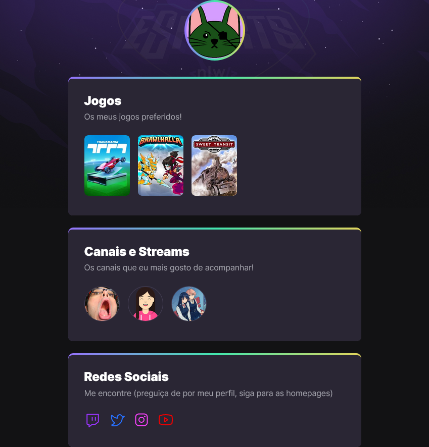

# NLW E-SPORTS
<b>Projeto desenvolvido durante a Next Level Week da Rocketseat</b>

## Objetivo
O objetivo do projeto foi construir um simples agregador de links seguindo a temática de e-sports. 

### Tecnologias
Para a construção deste pequeno site foram utilizados:
- HTML
- CSS

### Aprendizado
A construção deste projeto reforçou alguns conceitos importantes de HTML, como a
utilização correta de algumas tags, e também sugeriu algumas formas de organizar
a estrutura do site.  Em CSS também pude relembrar alguns pontos e aprender outros,
como a utilização de seletores, da precedência do seletor mais específico e como
criar alguns efeitos e pequenas animações.

### Conclusão
Ao fazer este projeto fica claro que utilizar essas tecnologias não é algo complicado
além da conta, e que, podemos alcançar um bom resultado com coisas simples. Neste caso,
nada além de HTML e CSS puros.

